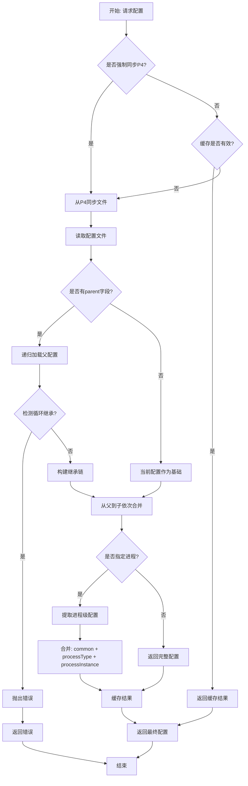

# 配置加载流程与优先级

## 1. 加载流程总览



## 2. 详细加载步骤

### 2.1 步骤1: 参数解析

从请求中提取参数：

```python
def parse_request_params(request) -> dict:
    return {
        'env': request.args.get('env'),              # 环境名 (必选)
        'branchType': request.args.get('branchType', 'mainline'),  # 分支类型
        'processType': request.args.get('processType'),  # 进程类型 (可选)
        'processId': request.args.get('processId'),      # 进程ID (可选)
        'syncP4': parse_bool(request.args.get('syncP4'), default=False)  # 是否同步
    }
```

**参数说明**:
- `env`: 环境名称 (如 `c7_partner`, `c7_weekly`)
- `branchType`: P4分支类型 (`mainline` 或 `weekly`)
- `processType`: 进程类型 (如 `logic`, `dbmgr`, `router`)
- `processId`: 进程实例ID (如 `1`, `2`)
- `syncP4`: 是否强制从P4同步 (默认 `false`，使用缓存)

### 2.2 步骤2: 构建配置路径

```python
def build_config_path(env: str, branchType: str = 'mainline') -> tuple:
    """
    构建P4路径和本地路径
    
    返回: (p4_path, local_path)
    """
    # 确定子目录 (production 或 local)
    if env.startswith('c7_dev') or env.startswith('c7_qa'):
        sub_dir = 'local'
    else:
        sub_dir = 'production'
    
    # 构建P4路径
    if branchType == 'weekly':
        p4_path = f"//C7/Development/Weekly/Server/config/{sub_dir}/{env}.json"
    else:
        p4_path = f"//C7/Development/Mainline/Server/config/{sub_dir}/{env}.json"
    
    # 构建本地路径
    local_path = os.path.join(config.P4_WORKSPACE_DIRECTORY, 
                              p4_path.replace("//", ""))
    
    return p4_path, local_path
```

### 2.3 步骤3: 缓存检查

```python
def get_cached_config(cache_key: str, p4_path: str) -> Optional[dict]:
    """
    检查缓存是否有效
    
    有效条件:
    1. 内存缓存中存在该key
    2. 缓存的changelist与P4最新changelist一致
    """
    if cache_key not in config_cache:
        return None
    
    cached_data = config_cache[cache_key]
    cached_cl = cached_data.get('changelist', 0)
    
    # 获取P4最新changelist
    latest_cl = p4Utils.get_latest_changelist(p4_path)
    
    if cached_cl == latest_cl:
        app.logger.info(f"Cache hit for {cache_key} @ CL {latest_cl}")
        return cached_data['result']
    else:
        app.logger.info(f"Cache stale: cached CL {cached_cl}, latest CL {latest_cl}")
        return None
```

### 2.4 步骤4: P4文件同步

```python
def sync_p4_file(p4_path: str, local_path: str, force: bool = True) -> bool:
    """
    从P4同步文件到本地
    """
    try:
        ret = p4Utils.update_file(p4_path, local_path, force=force, changelist=0)
        if not ret:
            raise P4SyncError(f"Failed to sync: {p4_path}")
        return True
    except Exception as e:
        app.logger.error(f"P4 sync error: {e}")
        return False
```

### 2.5 步骤5: 加载配置文件

```python
def load_config_file(local_path: str) -> dict:
    """
    读取并解析JSON配置文件
    """
    if not os.path.exists(local_path):
        raise FileNotFoundError(f"Config file not found: {local_path}")
    
    try:
        with open(local_path, 'r', encoding='utf-8') as f:
            return json.load(f)
    except json.JSONDecodeError as e:
        raise ConfigParseError(f"Invalid JSON in {local_path}: {e}")
```

### 2.6 步骤6: 递归加载父配置

```python
def load_config_with_inheritance(local_path: str, visited: set = None) -> dict:
    """
    递归加载配置及其父配置
    
    返回: 完全合并后的配置
    """
    if visited is None:
        visited = set()
    
    # 规范化路径
    abs_path = os.path.abspath(local_path)
    
    # 循环检测
    if abs_path in visited:
        raise CircularInheritanceError(
            f"Circular inheritance detected: {abs_path}\n"
            f"Inheritance chain: {' -> '.join(visited)} -> {abs_path}"
        )
    
    visited.add(abs_path)
    
    # 读取当前配置
    config = load_config_file(abs_path)
    
    # 如果没有parent，返回当前配置
    if 'parent' not in config:
        return config
    
    # 解析父配置路径
    parent_path = resolve_parent_path(abs_path, config['parent'])
    
    # 递归加载父配置
    parent_config = load_config_with_inheritance(parent_path, visited.copy())
    
    # 合并配置 (父 <- 子)
    return deep_merge(parent_config, config)
```

### 2.7 步骤7: 提取进程配置

```python
def extract_process_config(config: dict, process_type: str, process_id: int) -> dict:
    """
    提取指定进程的最终配置
    
    合并顺序: common -> processType -> processType_processId
    """
    result = {}
    
    # 1. 合并 common
    if 'common' in config:
        result = deep_merge(result, config['common'])
    
    # 2. 合并进程类型配置
    if process_type and process_type in config:
        result = deep_merge(result, config[process_type])
    
    # 3. 合并具体进程实例配置
    if process_id:
        process_key = f"{process_type}_{process_id}"
        if process_key in config:
            result = deep_merge(result, config[process_key])
    
    return result
```

### 2.8 步骤8: 缓存结果

```python
def cache_config_result(cache_key: str, p4_path: str, result: dict):
    """
    缓存配置结果
    """
    latest_cl = p4Utils.get_latest_changelist(p4_path)
    
    config_cache[cache_key] = {
        'result': result,
        'changelist': latest_cl,
        'timestamp': time.time()
    }
    
    app.logger.info(f"Cached config {cache_key} @ CL {latest_cl}")
```

## 3. 配置优先级

### 3.1 继承链优先级 (从低到高)

```
conf_base.json
    ↓
conf_linux.json
    ↓
c7_dev_weekly.generated.json
    ↓
c7_dev_weekly.json
```

- **规则**: 子配置覆盖父配置
- **合并方向**: 从根到叶（从父到子）依次合并

### 3.2 进程级优先级 (从低到高)

```
common
    ↓
logic (进程类型)
    ↓
logic_1 (进程实例)
```

- **规则**: 优先级高的覆盖优先级低的
- **合并方向**: 从通用到具体依次合并

### 3.3 综合优先级示例

假设有如下配置文件：

**conf_base.json**:
```json
{
  "common": {"logLevel": "debug"}
}
```

**conf_linux.json**:
```json
{
  "parent": "conf_base.json",
  "common": {"logLevel": "info"}
}
```

**c7_partner.json**:
```json
{
  "parent": "conf_linux.json",
  "common": {"logLevel": "warn"},
  "logic": {"logLevel": "info"},
  "logic_1": {"logLevel": "debug"}
}
```

**请求**: `env=c7_partner`, `processType=logic`, `processId=1`

**优先级顺序** (从低到高):
1. `conf_base.json` → `common` → `logLevel: "debug"`
2. `conf_linux.json` → `common` → `logLevel: "info"` ✅ (覆盖1)
3. `c7_partner.json` → `common` → `logLevel: "warn"` ✅ (覆盖2)
4. `c7_partner.json` → `logic` → `logLevel: "info"` ✅ (覆盖3)
5. `c7_partner.json` → `logic_1` → `logLevel: "debug"` ✅ (覆盖4)

**最终结果**: `logLevel: "debug"`

## 4. 缓存策略

### 4.1 缓存层级

```
L1: 内存缓存 (Python dict)
    ↓ (miss)
L2: 文件缓存 (可选，未实现)
    ↓ (miss)
P4 同步 + 重新加载
```

### 4.2 缓存Key生成

```python
def generate_cache_key(env: str, branchType: str, 
                       processType: str = None, processId: int = None) -> str:
    """
    生成唯一的缓存key
    """
    parts = [f"config_{env}_{branchType}"]
    
    if processType:
        parts.append(processType)
    
    if processId:
        parts.append(str(processId))
    
    return "_".join(parts)

# 示例:
# config_c7_partner_mainline
# config_c7_partner_mainline_logic
# config_c7_partner_mainline_logic_1
```

### 4.3 缓存失效条件

缓存在以下情况失效：

1. **Changelist不匹配**: 缓存的CL与P4最新CL不一致
2. **强制同步**: 请求参数 `syncP4=true`
3. **缓存过期**: 超过TTL（可选，当前未实现）
4. **手动清除**: 调用清除缓存API

### 4.4 缓存清除API

```python
@app.route('/clearConfigCache', methods=['POST'])
def clear_config_cache():
    """
    清除配置缓存
    
    参数:
    - env: 指定环境 (可选，不指定则清除全部)
    - branchType: 指定分支 (可选)
    """
    env = request.args.get('env')
    branchType = request.args.get('branchType')
    
    if env:
        # 清除指定环境的缓存
        prefix = f"config_{env}"
        if branchType:
            prefix += f"_{branchType}"
        
        keys_to_remove = [k for k in config_cache.keys() if k.startswith(prefix)]
        for key in keys_to_remove:
            del config_cache[key]
        
        return jsonify({'message': f'Cleared {len(keys_to_remove)} cache entries'})
    else:
        # 清除全部缓存
        count = len(config_cache)
        config_cache.clear()
        return jsonify({'message': f'Cleared all {count} cache entries'})
```

## 5. 错误处理流程

### 5.1 文件不存在

```python
if not os.path.exists(local_path):
    return jsonify({
        'errMsg': f'Config file not found: {local_path}',
        'p4Path': p4_path,
        'localPath': local_path
    }), 404
```

### 5.2 JSON解析失败

```python
try:
    config = json.load(f)
except json.JSONDecodeError as e:
    return jsonify({
        'errMsg': f'Invalid JSON format',
        'file': local_path,
        'error': str(e),
        'line': e.lineno,
        'column': e.colno
    }), 400
```

### 5.3 循环继承

```python
if abs_path in visited:
    chain = ' -> '.join(visited) + f' -> {abs_path}'
    return jsonify({
        'errMsg': 'Circular inheritance detected',
        'inheritanceChain': chain,
        'files': list(visited)
    }), 400
```

### 5.4 P4同步失败

```python
ret = p4Utils.update_file(p4_path, local_path, force=True)
if not ret:
    return jsonify({
        'errMsg': f'Failed to sync config from P4',
        'p4Path': p4_path,
        'suggestion': 'Check P4 connection or file permissions'
    }), 500
```

## 6. 完整API示例

### 6.1 获取完整配置

**请求**:
```http
GET /getConfig?env=c7_partner&branchType=mainline&syncP4=false
```

**响应**:
```json
{
  "env": "c7_partner",
  "branchType": "mainline",
  "configP4Path": "//C7/Development/Mainline/Server/config/production/c7_partner.json",
  "configP4PathAtCL": "//C7/Development/Mainline/Server/config/production/c7_partner.json@12345",
  "configChangelist": 12345,
  "data": {
    "common": {...},
    "logic": {...},
    "logic_1": {...},
    ...
  }
}
```

### 6.2 获取进程配置

**请求**:
```http
GET /getConfig?env=c7_partner&processType=logic&processId=1&syncP4=false
```

**响应**:
```json
{
  "env": "c7_partner",
  "branchType": "mainline",
  "processType": "logic",
  "processId": 1,
  "configP4Path": "//C7/Development/Mainline/Server/config/production/c7_partner.json",
  "configChangelist": 12345,
  "data": {
    "namespace": "c7_partner",
    "logLevel": "info",
    "lua_call_timeout": 5000,
    "database": "c7_partner",
    "ip": "inner_ip1",
    "console": {
      "ip": "127.0.0.1",
      "port": 7601
    },
    ...
  }
}
```

### 6.3 强制同步

**请求**:
```http
GET /getConfig?env=c7_partner&syncP4=true
```

**说明**: 忽略缓存，强制从P4同步最新配置

## 7. 性能优化建议

### 7.1 缓存预热

在服务启动时预加载常用配置：

```python
def preheat_config_cache():
    """
    预热配置缓存
    """
    common_envs = ['c7_partner', 'c7_weekly', 'c7_online']
    
    for env in common_envs:
        try:
            load_config(env, 'mainline', syncP4=True)
            app.logger.info(f"Preheated config: {env}")
        except Exception as e:
            app.logger.error(f"Failed to preheat {env}: {e}")
```

### 7.2 异步刷新

后台定时刷新缓存，避免首次请求慢：

```python
import threading

def refresh_cache_periodically():
    """
    定时刷新配置缓存 (每10分钟)
    """
    while True:
        time.sleep(600)  # 10分钟
        
        for key in list(config_cache.keys()):
            try:
                # 异步刷新缓存
                refresh_single_cache(key)
            except Exception as e:
                app.logger.error(f"Failed to refresh cache {key}: {e}")

# 启动后台线程
threading.Thread(target=refresh_cache_periodically, daemon=True).start()
```

### 7.3 增量同步

只同步变更的文件，避免全量同步：

```python
def sync_if_changed(p4_path: str, local_path: str) -> bool:
    """
    仅在P4文件变更时同步
    """
    if not os.path.exists(local_path):
        return p4Utils.update_file(p4_path, local_path)
    
    local_cl = get_local_file_changelist(local_path)
    latest_cl = p4Utils.get_latest_changelist(p4_path)
    
    if local_cl < latest_cl:
        return p4Utils.update_file(p4_path, local_path)
    
    return True  # 已是最新
```
